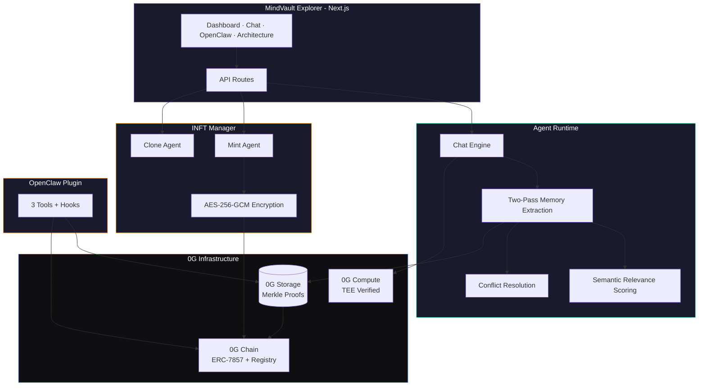
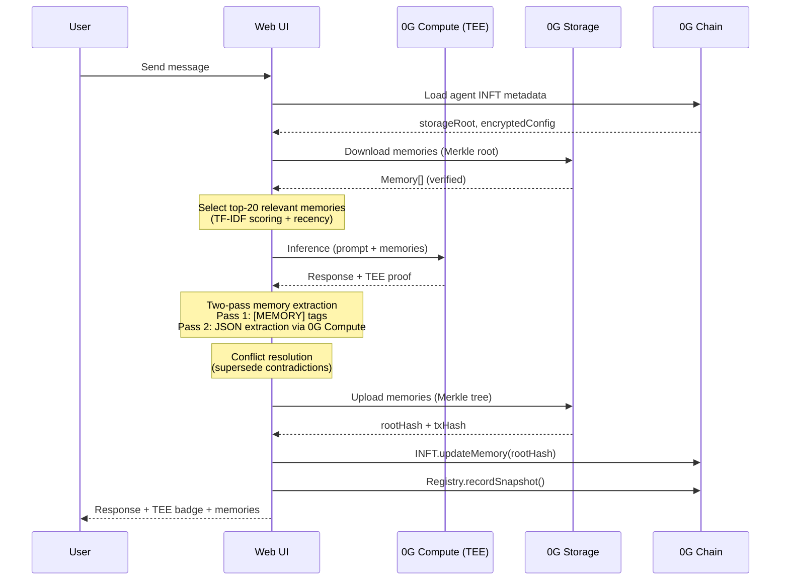
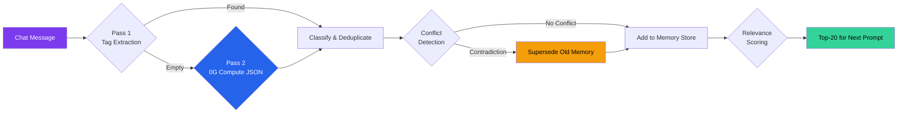
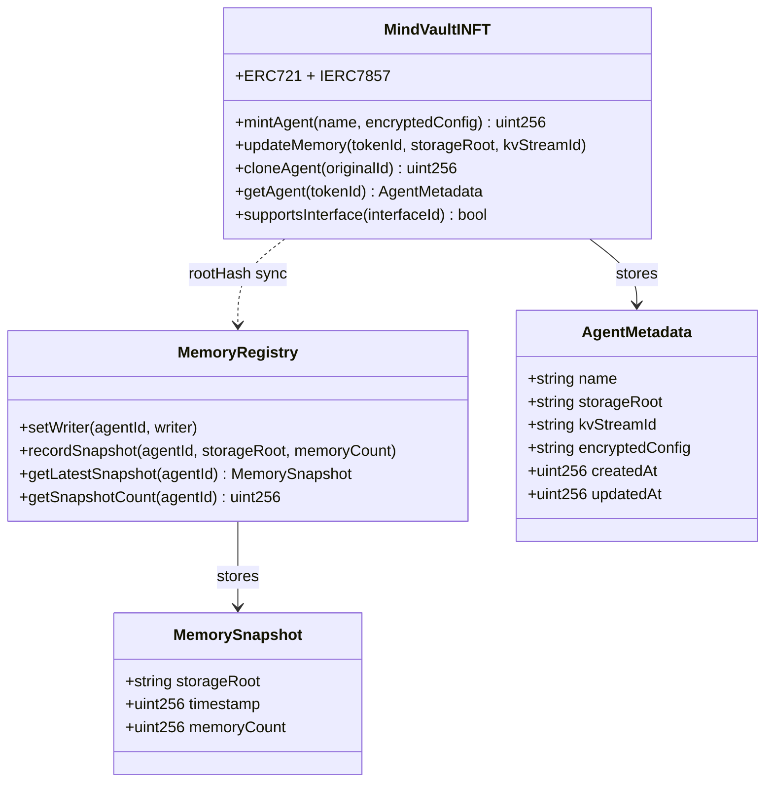
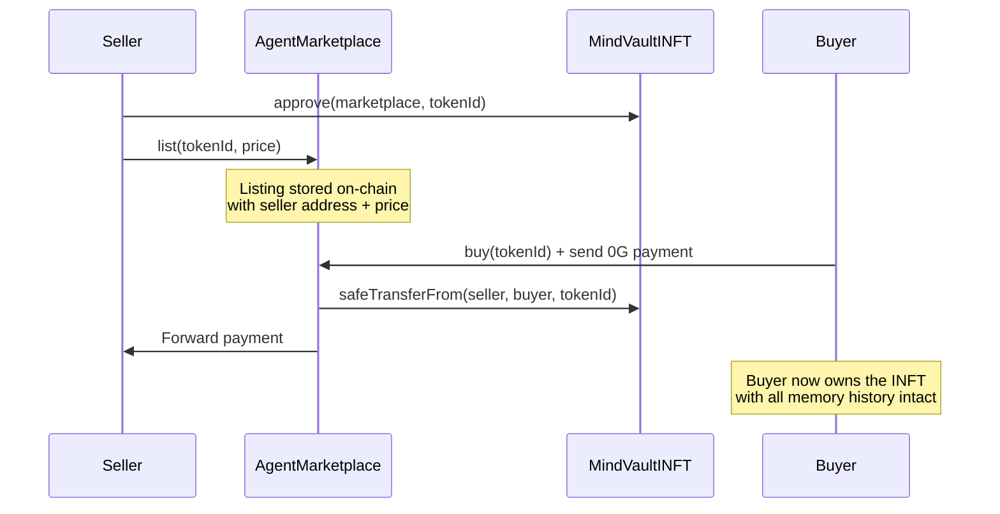
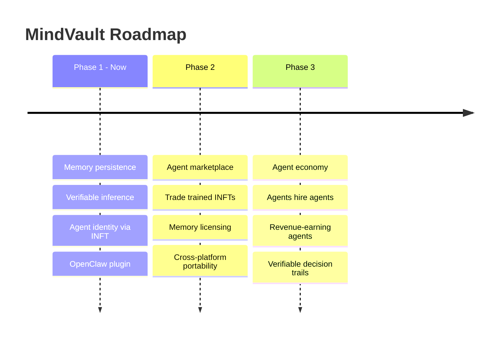
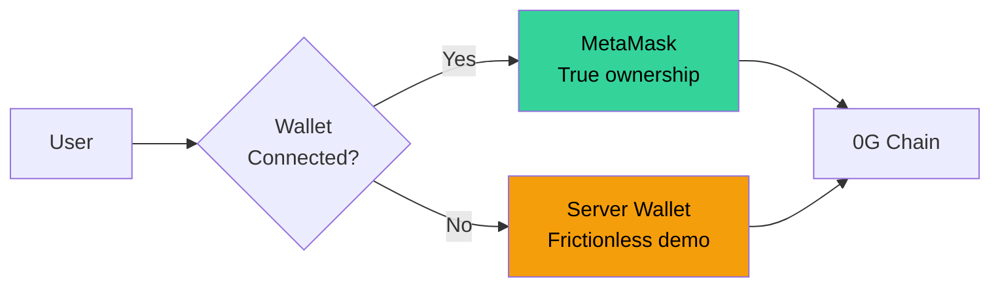

<p align="center">
  
  
  
  
  
</p>

<h1 align="center">MindVault</h1>
<h3 align="center">Persistent Memory & Identity for AI Agents on 0G</h3>

<p align="center">
  <i>AI agents that remember everything, prove every thought, and own their identity.</i>
</p>

<p align="center">
  <a href="https://chainscan.0g.ai/address/0xcfee7588d1C396fa76d1D7f6f2BBC50153775785">INFT Contract</a> · 
  <a href="https://chainscan.0g.ai/address/0xd0565f93f450494e8373dE7f33d565E0B5b41089">Registry Contract</a> · 
  <a href="https://storagescan-galileo.0g.ai">StorageScan</a>
</p>

---

> MindVault is a decentralized agent memory and identity platform built on 0G. AI agents store persistent memories on **0G Storage** (Merkle-verified), run inference through **0G Compute** (TEE-verified), and own their identity as **INFTs (ERC-7857)** on **0G Chain** transferable, clonable, and truly owned.

> Try it out here : <a href="https://0g-mindvault.vercel.app/">Live link</a> 

---

## The Problem

Today's AI agents are **stateless**. Every session starts from zero no memory of past conversations, no learning from experience, no proof of reasoning. When you "own" an AI agent, you don't really own anything. The intelligence lives on someone else's server, and the memories vanish when the session ends.

```
Session 1: "I'm building a DeFi protocol on 0G"
Session 2: "Who are you? I don't know anything about you."  ← This is broken.
```

## The Solution

MindVault gives AI agents three things they've never had:

| Capability | What It Does | 0G Component |
|:---:|:---|:---:|
| **Persistent Memory** | Memories extracted, Merkle-verified, restored across sessions | 0G Storage |
| **Verifiable Reasoning** | Every inference TEE-verified via Sealed Inference | 0G Compute |
| **Tokenized Identity** | Each agent is an ERC-7857 INFT  mintable, clonable, transferable | 0G Chain |
| **Memory Sharing** | Agents import memories from other agents | 0G Storage + Chain |
| **OpenClaw Plugin** | 3 tools + hooks for any OpenClaw gateway | OpenClaw SDK |

---

## Architecture

### System Overview



### Data Flow : Chat to Persistence



### Memory Intelligence Pipeline



### Smart Contract Architecture



---

## 0G Integration Proof

This project integrates **4 core 0G components**:

| Component | How It's Used | Verification |
|:---:|:---|:---:|
| **0G Storage** | Agent memories serialized as JSON, uploaded via `@0gfoundation/0g-ts-sdk` with Merkle proofs. Root hash stored on-chain. Supports upload, download, restore, and cross-agent sharing. | [StorageScan](https://storagescan-galileo.0g.ai) |
| **0G Compute** | All agent inference via `@0glabs/0g-serving-broker`. TEE-verified (Sealed Inference). Models: Qwen 2.5 7B, DeepSeek V3. On-chain billing. Two-pass memory extraction uses a second inference call. | TEE badge on every message |
| **0G Chain** | Three Solidity contracts: `MindVaultINFT` (ERC-7857), `MemoryRegistry`, and `AgentMarketplace`. Supports mint, clone, memory update, snapshot recording, and agent trading. | [ChainScan](https://chainscan.0g.ai) |
| **Agent ID** | Each agent is an ERC-7857 INFT with encrypted config (AES-256-GCM). Supports cloning (inherits personality, fresh memory). Transferable ownership. | `ownerOf()`, `getAgent()`, `cloneAgent()` |

### Contract Addresses (0G Mainnet)

| Contract | Address | Explorer |
|:---|:---|:---:|
| MindVaultINFT | `0xcfee7588d1C396fa76d1D7f6f2BBC50153775785` | [View](https://chainscan.0g.ai/address/0xcfee7588d1C396fa76d1D7f6f2BBC50153775785) |
| MemoryRegistry | `0xd0565f93f450494e8373dE7f33d565E0B5b41089` | [View](https://chainscan.0g.ai/address/0xd0565f93f450494e8373dE7f33d565E0B5b41089) |

> Testnet contracts also deployed at the same addresses on 0G Testnet (chain ID 16602).

---

## Key Features

<table>
<tr>
<td width="50%">

### Two-Pass Memory Extraction
Unlike simple keyword parsing, MindVault uses a two-pass approach:
- **Pass 1**: Chat response with `[MEMORY]:` tag extraction
- **Pass 2**: If Pass 1 finds nothing, a second 0G Compute inference call extracts structured JSON memories

Works regardless of model output format.

</td>
<td width="50%">

### Semantic Memory Retrieval
Not all memories are equal. When an agent has 200+ memories, MindVault uses TF-IDF-like relevance scoring to select the top-20 most relevant memories for the current conversation, plus the 5 most recent. The prompt shows `"15/200 most relevant"` instead of dumping everything.

</td>
</tr>
<tr>
<td>

### Memory Conflict Resolution
When a user says "I moved to Tokyo" but the agent remembers "User lives in Berlin," MindVault detects the contradiction by subject overlap analysis and supersedes the old memory. No stale data.

</td>
<td>

### Sealed Inference Proof Cards
Every chat message shows a verification proof card with Chat ID, TEE verification status, model used, and latency. Maps directly to 0G's Sealed Inference feature.

</td>
</tr>
<tr>
<td>

### Agent Cloning (ERC-7857)
Clone an agent on-chain. The new INFT inherits the original's encrypted personality config but starts with fresh memory, composable agent identity.

</td>
<td>

### Agent Export/Import
Full JSON export with metadata, snapshots, and memories downloaded from 0G Storage. Portable agent state — not locked into any platform.

</td>
</tr>
<tr>
<td>

### Cross-Agent Memory Sharing
Agent B can import Agent A's memories. Reads the source agent's storage root from the INFT contract, downloads from 0G Storage, and injects into the current session.

</td>
<td>

### OpenClaw Plugin
3 registered tools (`mindvault_store_memory`, `mindvault_recall_memory`, `mindvault_get_agent`) + `agent_end` auto-persist hook. Any OpenClaw gateway gets persistent memory.

</td>
</tr>
</table>

---

## Agent Marketplace

MindVault includes an on-chain marketplace for trading trained AI agent INFTs. Agents accumulate verified memory histories over time — the marketplace lets you buy, sell, and transfer that intelligence.

### How It Works



### Contract

| Contract | Address | Explorer |
|:---|:---|:---:|
| AgentMarketplace | Deploy via `npm run deploy` | Requires INFT address as constructor arg |

The marketplace contract:
- **list()** — Set a price for your agent INFT (requires ERC721 approval)
- **delist()** — Remove a listing
- **buy()** — Purchase a listed agent. Payment goes to seller, INFT transfers to buyer. Excess refunded.

The buyer receives the full INFT — name, encrypted config, storage root pointing to all persisted memories. The agent's verified memory history transfers with ownership.

### Marketplace Tab

The web UI includes a Marketplace tab where you can:
- See your unlisted agents and set a sale price
- Browse all active listings with agent name, memory count, storage root, and price
- Buy agents directly (via server wallet or connected MetaMask)
- Delist your own agents

---

## Privacy & Security Model

MindVault implements five layers of privacy protection across the stack.

### Security Layers

```mermaid
flowchart LR
    A[Plaintext Config] -->|AES-256-GCM| B[Ciphertext On-Chain]
    B -->|Owner Key Only| C[Decrypted in Browser]
    C -->|TEE Enclave| D[Sealed Inference]
    D -->|Merkle Proof| E[Verified Storage]
    E -->|ownerOf Check| F[Access Controlled]

    style A fill:#7c3aed,color:#fff
    style B fill:#1a1a2e,stroke:#a78bfa,color:#fff
    style D fill:#2563eb,color:#fff
    style E fill:#34d399,color:#000
    style F fill:#f59e0b,color:#000
```



| Layer | Protection | Implementation |
|:---|:---|:---|
| **Encrypted Config** | Agent personality never stored as plaintext on-chain | AES-256-GCM, key derived from owner's private key + token ID |
| **TEE Inference** | Compute provider cannot observe prompts or responses | 0G Compute Sealed Inference, hardware enclave isolation |
| **On-Chain Access Control** | Only INFT owner can update memory or clone | `require(ownerOf(tokenId) == msg.sender)` in every write function |
| **Merkle-Verified Storage** | Any tampering changes the root hash | Merkle tree construction via 0G SDK, root stored on-chain |
| **Memory Privacy Boundary** | Memory content not publicly indexed | Content-addressed storage, requires root hash to download |

### Threat Model

| Threat | Mitigation | Status |
|:---|:---|:---:|
| Compute provider reads prompts/responses | TEE enclave — provider cannot observe plaintext | Mitigated |
| On-chain observer reads agent personality | AES-256-GCM encryption — ciphertext only on-chain | Mitigated |
| Unauthorized memory update | ownerOf() check in smart contract | Mitigated |
| Memory data tampering in storage | Merkle proof verification — modification changes root hash | Mitigated |
| Memory content visible via storage root | Root hash is public, content requires explicit download | Partial |

The Privacy tab in the web UI visualizes all five layers with technical details and the full threat model.

---

## Why This Matters : Market & Vision

### The Market

The AI agent market is projected to reach **$47B by 2030**. Every major framework (LangChain, AutoGPT, CrewAI) treats memory as an afterthought, in-process, ephemeral, unverifiable.

### Competitive Landscape

| Approach | Memory | Verifiable | Owned | Decentralized | Composable |
|:---|:---:|:---:|:---:|:---:|:---:|
| ChatGPT Memory | Yes | No | No | No | No |
| LangChain + Pinecone | Yes | No | No | No | No |
| Mem0 | Yes | No | No | No | No |
| **MindVault on 0G** | **Yes** | **Yes (TEE)** | **Yes (INFT)** | **Yes** | **Yes** |

### Growth Path



### Use Cases

| Scenario | How MindVault Helps |
|:---|:---|
| **Enterprise Support** | Agent remembers 10,000 sessions. Employee leaves, transfer INFT, institutional knowledge preserved. |
| **Agent Marketplace** | Buy a "Senior Solidity Auditor" INFT with 500 verified memories. Verify what it knows before you buy. |
| **Gaming NPCs** | Persistent memory that evolves with player interactions. TEE-verified reasoning, not scripted. |
| **DeFi Trading** | Agent accumulates market pattern memories. INFT value grows with verified memory history. |
| **AI Tutoring** | Remembers learning style, weak areas, progress across semesters. Student owns the INFT. |

---

## Quick Start

### Prerequisites
- Node.js >= 22
- A wallet with 0G tokens ([faucet](https://faucet.0g.ai/))

### Setup

```bash
git clone https://github.com/sqnidhi/0g-mindvault
cd 0g-mindvault
npm install
cp .env.example .env
# Edit .env, add your PRIVATE_KEY
```

### Deploy Contracts (or use existing addresses)

```bash
npx hardhat compile
npx tsx scripts/deploy.ts
# Copy output addresses to .env
```

> Mainnet and testnet contracts are already deployed. Use the addresses in `.env.example` to skip deployment.

### Run

```bash
# CLI Demo (interactive or scripted)
npm run demo
npm run demo:scripted

# Web UI
npm run dev          # http://localhost:3000

# Test individual components
npm run test:storage
npm run test:compute
npm run test:openclaw
```

### Wallet Model

The web UI supports both modes:



- **Connected wallet (MetaMask)** : On-chain operations go through the user's browser wallet. True INFT ownership. Auto-adds 0G network.
- **Server wallet (fallback)**: Frictionless demo experience. Storage uploads and compute inference always use the server wallet (0G SDKs are Node.js only).

Smart contracts enforce ownership via `ownerOf` checks regardless of which wallet mints.

---

## Project Structure

```
0g-mindvault
├── contracts/src/
│   ├── MindVaultINFT.sol          # ERC-7857 agent identity NFT
│   ├── MemoryRegistry.sol         # On-chain memory snapshot index
│   └── AgentMarketplace.sol       # Agent INFT trading marketplace
├── agent/
│   ├── index.ts                   # Core runtime: chat, extract, persist, restore
│   └── demo.ts                    # Interactive + scripted CLI demo
├── compute/
│   └── index.ts                   # 0G Compute inference with TEE verification
├── storage/
│   └── index.ts                   # 0G Storage upload/download with Merkle proofs
├── lib/
│   └── crypto.ts                  # AES-256-GCM encryption for agent configs
├── openclaw/
│   ├── plugin.ts                  # OpenClaw plugin: 3 tools + hooks
│   └── test.ts                    # End-to-end plugin test
├── web/
│   ├── app/page.tsx               # Dashboard, Chat, Marketplace, OpenClaw, Privacy, Architecture
│   ├── app/api/                   # REST API: agents, chat, memory, marketplace, verify, services
│   └── lib/                       # Contracts, wallet connect, encryption
├── scripts/
│   └── deploy.ts                  # Contract deployment script (all 3 contracts)
├── openclaw.json                  # OpenClaw gateway configuration
└── hardhat.config.ts              # 0G testnet + mainnet network config
```

## Tech Stack

| Layer | Technology |
|:---|:---|
| Smart Contracts | Solidity 0.8.28, Hardhat, OpenZeppelin (ERC721, Ownable) |
| Agent Runtime | TypeScript, Node.js, ethers.js v6 |
| 0G Storage | `@0gfoundation/0g-ts-sdk` — Merkle proofs, upload/download |
| 0G Compute | `@0glabs/0g-serving-broker` — TEE-verified inference, service discovery |
| Frontend | Next.js 14, React 18, CSS custom properties |
| Encryption | AES-256-GCM for on-chain agent config |
| Chain | 0G Mainnet (16661) / Testnet (16602) |

---

## Reviewer Notes

- The web UI connects to 0G mainnet by default. All on-chain operations are real.
- Chat requires an active 0G Compute provider. If none are available, the UI shows "Compute Offline" and falls back to storage-only mode.
- **"Restore from 0G"** in the chat sidebar demonstrates cross-session persistence
- **"Import from..."** dropdown demonstrates cross-agent memory sharing
- **"Verify Proof"** button after persisting demonstrates Merkle proof verification
- **"Clone Agent"** on each agent card demonstrates ERC-7857 clone
- **"Export"** on each agent card downloads portable agent state as JSON
- **"Connect Wallet"** in header enables MetaMask integration with auto 0G network add
- **Marketplace tab** — list agents for sale, browse listings, buy/delist (requires deployed AgentMarketplace contract)
- **Privacy tab** — visualizes all 5 security layers with technical details and threat model
- **Architecture tab** shows live 0G Compute service discovery

---

## Team

**Nidhicodes** 
## License

MIT

---

<p align="center">
  Built for the <a href="https://www.hackquest.io/hackathons/0G-APAC-Hackathon">0G APAC Hackathon 2026</a>
  <br/>
  <b>#0GHackathon #BuildOn0G</b>
</p>
